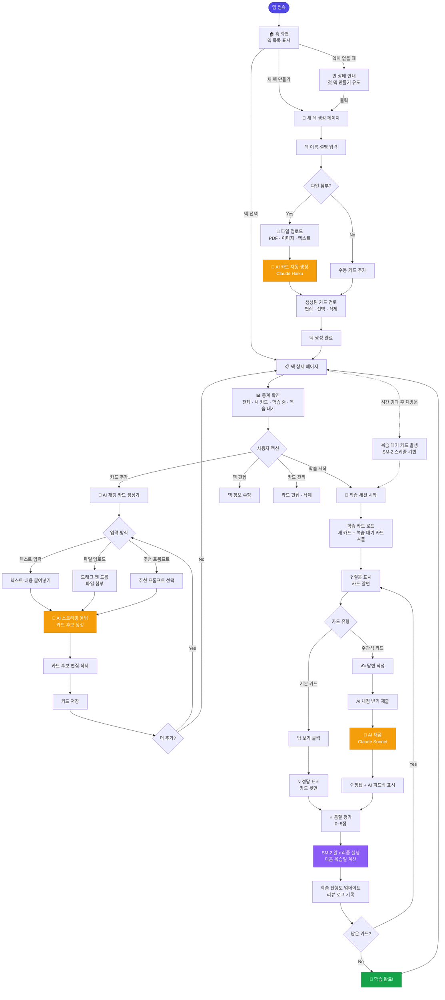
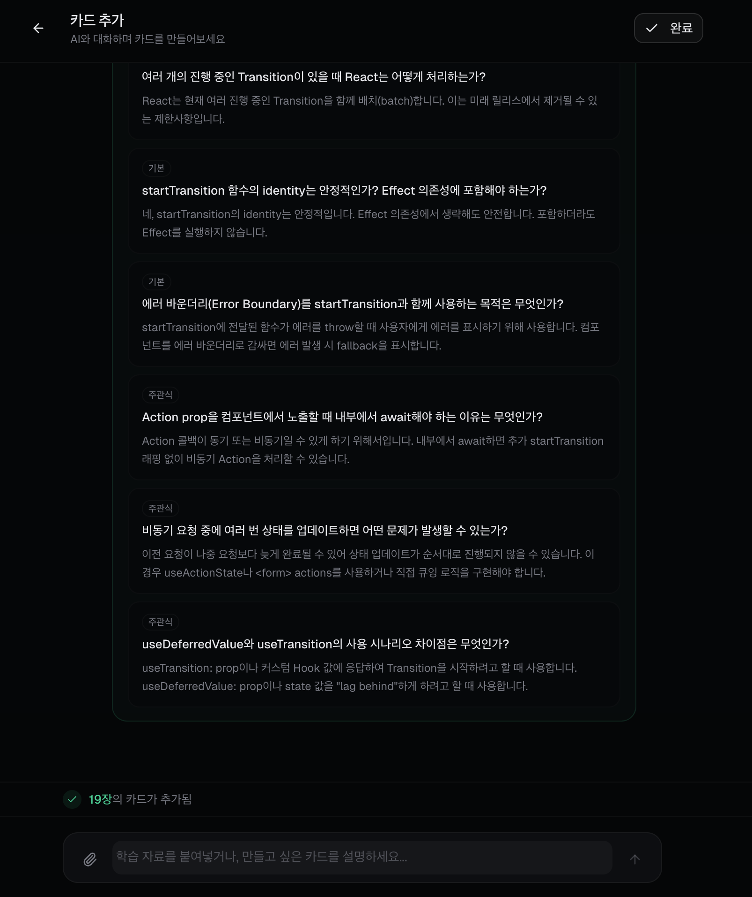
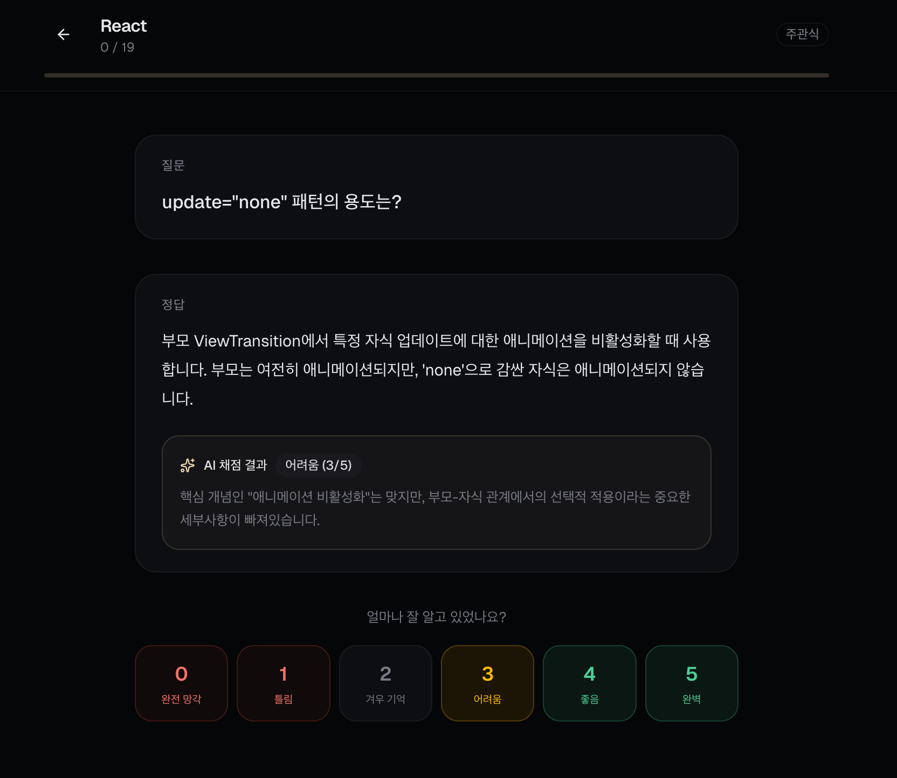

# Amki - 애플리케이션 사용 흐름

## 플로우차트

```mermaid
flowchart TD
    Start([앱 접속]) --> Home["🏠 홈 화면<br/>덱 목록 표시"]

    Home -->|덱이 없을 때| EmptyState["빈 상태 안내<br/>첫 덱 만들기 유도"]
    Home -->|새 덱 만들기| NewDeck[📝 새 덱 생성 페이지]
    Home -->|덱 선택| DeckDetail[📋 덱 상세 페이지]

    %% 덱 생성 흐름
    EmptyState -->|클릭| NewDeck
    NewDeck --> InputDeck[덱 이름·설명 입력]
    InputDeck --> UploadCheck{파일 첨부?}
    UploadCheck -->|Yes| Upload["📎 파일 업로드<br/>PDF · 이미지 · 텍스트"]
    UploadCheck -->|No| ManualAdd[수동 카드 추가]
    Upload --> AIGenerate["🤖 AI 카드 자동 생성<br/>Claude Haiku"]
    AIGenerate --> ReviewCards["생성된 카드 검토<br/>편집 · 선택 · 삭제"]
    ManualAdd --> ReviewCards
    ReviewCards --> CreateDeck[덱 생성 완료]
    CreateDeck --> DeckDetail

    %% 덱 상세 페이지
    DeckDetail --> Stats["📊 통계 확인<br/>전체 · 새 카드 · 학습 중 · 복습 대기"]
    Stats --> DeckActions{사용자 액션}

    DeckActions -->|카드 추가| ChatCreator[💬 AI 채팅 카드 생성기]
    DeckActions -->|학습 시작| StudySession[📖 학습 세션 시작]
    DeckActions -->|덱 편집| EditDeck[덱 정보 수정]
    DeckActions -->|카드 관리| ManageCards[카드 편집 · 삭제]

    %% AI 채팅 카드 생성 흐름
    ChatCreator --> ChatInput{입력 방식}
    ChatInput -->|텍스트 입력| TypeText[텍스트·내용 붙여넣기]
    ChatInput -->|파일 업로드| DropFile["드래그 앤 드롭<br/>파일 첨부"]
    ChatInput -->|추천 프롬프트| SuggestPrompt[추천 프롬프트 선택]
    TypeText --> StreamResponse["🤖 AI 스트리밍 응답<br/>카드 후보 생성"]
    DropFile --> StreamResponse
    SuggestPrompt --> StreamResponse
    StreamResponse --> EditCandidates[카드 후보 편집·삭제]
    EditCandidates --> SaveCards[카드 저장]
    SaveCards --> MoreCards{더 추가?}
    MoreCards -->|Yes| ChatInput
    MoreCards -->|No| DeckDetail

    %% 학습 세션 흐름
    StudySession --> LoadCards["학습 카드 로드<br/>새 카드 + 복습 대기 카드<br/>셔플"]
    LoadCards --> ShowQuestion["❓ 질문 표시<br/>카드 앞면"]
    ShowQuestion --> CardType{카드 유형}

    CardType -->|기본 카드| ClickReveal[답 보기 클릭]
    CardType -->|주관식 카드| TypeAnswer[✍️ 답변 작성]

    ClickReveal --> ShowAnswer["💡 정답 표시<br/>카드 뒷면"]

    TypeAnswer --> SubmitAnswer[AI 채점 받기 제출]
    SubmitAnswer --> AIGrading["🤖 AI 채점<br/>Claude Sonnet"]
    AIGrading --> ShowFeedback[💡 정답 + AI 피드백 표시]

    ShowAnswer --> RateQuality["⭐ 품질 평가<br/>0~5점"]
    ShowFeedback --> RateQuality

    RateQuality --> SM2["SM-2 알고리즘 실행<br/>다음 복습일 계산"]
    SM2 --> UpdateProgress["학습 진행도 업데이트<br/>리뷰 로그 기록"]
    UpdateProgress --> MoreStudy{남은 카드?}
    MoreStudy -->|Yes| ShowQuestion
    MoreStudy -->|No| Complete[🎉 학습 완료!]
    Complete --> DeckDetail

    %% 반복 학습 흐름
    DeckDetail -.->|시간 경과 후 재방문| DueCards["복습 대기 카드 발생<br/>SM-2 스케줄 기반"]
    DueCards -.-> StudySession

    %% 스타일링
    style Start fill:#4f46e5,stroke:#3730a3,color:#fff
    style Complete fill:#16a34a,stroke:#15803d,color:#fff
    style AIGenerate fill:#f59e0b,stroke:#d97706,color:#fff
    style StreamResponse fill:#f59e0b,stroke:#d97706,color:#fff
    style AIGrading fill:#f59e0b,stroke:#d97706,color:#fff
    style SM2 fill:#8b5cf6,stroke:#7c3aed,color:#fff
```

## 주요 화면 스크린샷

