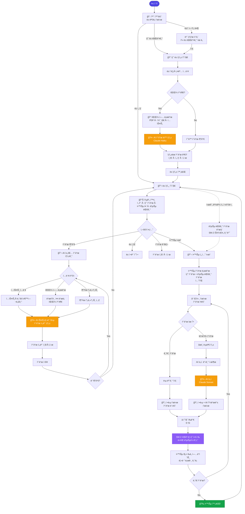

# Amki - 애플리케ì´ì…˜ 사용 í름

## 플로우차트

```mermaid
flowchart TD
    Start([앱 ì ‘ì†]) --> Home["🠠홈 화면<br/>ë± ëª©ë¡ í‘œì‹œ"]

    Home -->|ë±ì´ ì—†ì„ ë•Œ| EmptyState["빈 ìƒíƒœ 안내<br/>첫 ë± ë§Œë“¤ê¸° 유ë„"]
    Home -->|새 ë± ë§Œë“¤ê¸°| NewDeck[📠새 ë± ìƒì„± í˜ì´ì§€]
    Home -->|ë± ì„ íƒ| DeckDetail[📋 ë± ìƒì„¸ í˜ì´ì§€]

    %% ë± ìƒì„± í름
    EmptyState -->|í´ë¦­| NewDeck
    NewDeck --> InputDeck[ë± ì´ë¦„·설명 ì…ë ¥]
    InputDeck --> UploadCheck{íŒŒì¼ ì²¨ë¶€?}
    UploadCheck -->|Yes| Upload["ğŸ“ íŒŒì¼ ì—…ë¡œë“œ<br/>PDF · ì´ë¯¸ì§€ · í…스트"]
    UploadCheck -->|No| ManualAdd[ìˆ˜ë™ ì¹´ë“œ 추가]
    Upload --> AIGenerate["🤖 AI ì¹´ë“œ ìë™ ìƒì„±<br/>Claude Haiku"]
    AIGenerate --> ReviewCards["ìƒì„±ëœ ì¹´ë“œ 검토<br/>í¸ì§‘ · ì„ íƒ Â· ì‚­ì œ"]
    ManualAdd --> ReviewCards
    ReviewCards --> CreateDeck[ë± ìƒì„± 완료]
    CreateDeck --> DeckDetail

    %% ë± ìƒì„¸ í˜ì´ì§€
    DeckDetail --> Stats["📊 통계 확ì¸<br/>ì „ì²´ · 새 ì¹´ë“œ · 학습 중 · 복습 대기"]
    Stats --> DeckActions{사용ì ì•¡ì…˜}

    DeckActions -->|ì¹´ë“œ 추가| ChatCreator[💬 AI 채팅 ì¹´ë“œ ìƒì„±ê¸°]
    DeckActions -->|학습 ì‹œì‘| StudySession[📖 학습 세션 ì‹œì‘]
    DeckActions -->|ë± í¸ì§‘| EditDeck[ë± ì •ë³´ 수정]
    DeckActions -->|ì¹´ë“œ 관리| ManageCards[ì¹´ë“œ í¸ì§‘ · ì‚­ì œ]

    %% AI 채팅 ì¹´ë“œ ìƒì„± í름
    ChatCreator --> ChatInput{ì…ë ¥ ë°©ì‹}
    ChatInput -->|í…스트 ì…ë ¥| TypeText[í…스트·내용 붙여넣기]
    ChatInput -->|íŒŒì¼ ì—…ë¡œë“œ| DropFile["ë“œë˜ê·¸ 앤 드롭<br/>íŒŒì¼ ì²¨ë¶€"]
    ChatInput -->|추천 프롬프트| SuggestPrompt[추천 프롬프트 ì„ íƒ]
    TypeText --> StreamResponse["🤖 AI ìŠ¤íŠ¸ë¦¬ë° ì‘답<br/>ì¹´ë“œ 후보 ìƒì„±"]
    DropFile --> StreamResponse
    SuggestPrompt --> StreamResponse
    StreamResponse --> EditCandidates[ì¹´ë“œ 후보 í¸ì§‘·삭제]
    EditCandidates --> SaveCards[ì¹´ë“œ ì €ì¥]
    SaveCards --> MoreCards{ë” ì¶”ê°€?}
    MoreCards -->|Yes| ChatInput
    MoreCards -->|No| DeckDetail

    %% 학습 세션 í름
    StudySession --> LoadCards["학습 카드 로드<br/>새 카드 + 복습 대기 카드<br/>셔플"]
    LoadCards --> ShowQuestion["ⓠ질문 표시<br/>ì¹´ë“œ ì•ë©´"]
    ShowQuestion --> CardType{카드 유형}

    CardType -->|기본 ì¹´ë“œ| ClickReveal[답 보기 í´ë¦­]
    CardType -->|ì£¼ê´€ì‹ ì¹´ë“œ| TypeAnswer[âœï¸ 답변 ì‘성]

    ClickReveal --> ShowAnswer["💡 정답 표시<br/>카드 뒷면"]

    TypeAnswer --> SubmitAnswer[AI ì±„ì  ë°›ê¸° 제출]
    SubmitAnswer --> AIGrading["🤖 AI 채ì <br/>Claude Sonnet"]
    AIGrading --> ShowFeedback[💡 정답 + AI 피드백 표시]

    ShowAnswer --> RateQuality["⭠품질 í‰ê°€<br/>0~5ì "]
    ShowFeedback --> RateQuality

    RateQuality --> SM2["SM-2 알고리즘 실행<br/>ë‹¤ìŒ ë³µìŠµì¼ ê³„ì‚°"]
    SM2 --> UpdateProgress["학습 ì§„í–‰ë„ ì—…ë°ì´íŠ¸<br/>리뷰 로그 기ë¡"]
    UpdateProgress --> MoreStudy{ë‚¨ì€ ì¹´ë“œ?}
    MoreStudy -->|Yes| ShowQuestion
    MoreStudy -->|No| Complete[🉠학습 완료!]
    Complete --> DeckDetail

    %% 반복 학습 í름
    DeckDetail -.->|시간 경과 후 ì¬ë°©ë¬¸| DueCards["복습 대기 ì¹´ë“œ ë°œìƒ<br/>SM-2 스케줄 기반"]
    DueCards -.-> StudySession

    %% 스타ì¼ë§
    style Start fill:#4f46e5,stroke:#3730a3,color:#fff
    style Complete fill:#16a34a,stroke:#15803d,color:#fff
    style AIGenerate fill:#f59e0b,stroke:#d97706,color:#fff
    style StreamResponse fill:#f59e0b,stroke:#d97706,color:#fff
    style AIGrading fill:#f59e0b,stroke:#d97706,color:#fff
    style SM2 fill:#8b5cf6,stroke:#7c3aed,color:#fff
```

## 주요 화면 스í¬ë¦°ìƒ·

